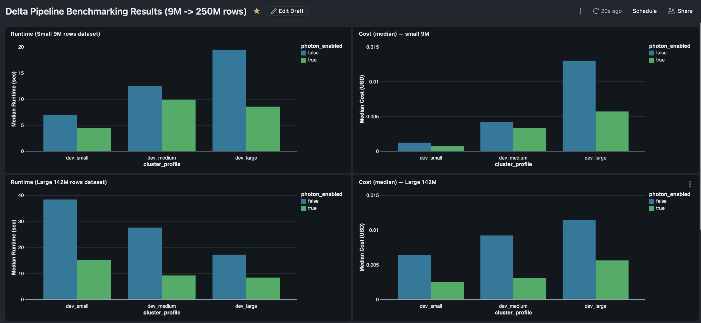
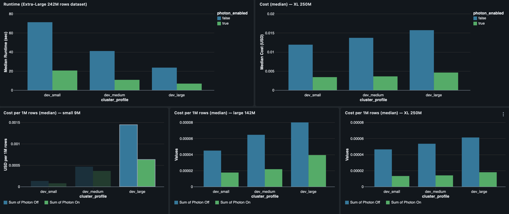
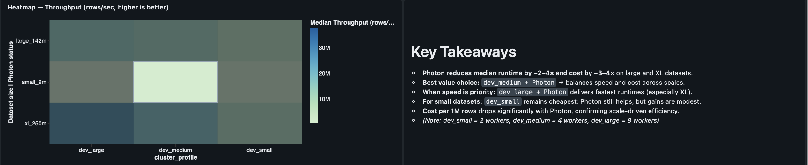

# ⚡ Delta Pipeline Benchmarking for Transactional Data (9M → 250M rows)

##  Executive Summary

This project benchmarks **Databricks Delta pipelines** on transactional workloads of different scales  (9M, 142M, 250M rows). It compares **Photon vs non-Photon execution**, cluster sizes, and cost/performance trade-offs.

**Goal:** Create a *right-sizing playbook* that balances runtime, cost, and throughput for real-world transactional data pipelines.
---

## 📌 Objectives
- Benchmark transactional ETL pipelines across **cluster profiles** (`dev_small`, `dev_medium`, `dev_large`).  
- Compare **Photon ON/OFF**, **AQE**, and shuffle partition configs.  
- Track key metrics:  
  - Runtime (median seconds)  
  - Median cost ($)  
  - Cost per 1M rows  
  - Throughput (rows/sec)  
- Produce a **professional dashboard + PDF report**.  
- Deliver a **reproducible repo** with SQL + sample data.

---

## 📂 Repo Structure

```text
Benching_Project/
├── notebooks/              # Pipeline notebooks
│   ├── 01_data_prep_driver.ipynb
│   ├── 02_silver_benchmarking.ipynb
│   └── 03_gold_aggregates.ipynb
│
├── sql/                   # Queries for dashboards
│   ├── 00_temp_setup.sql
│   ├── 01_stats_view.sql
│   ├── 02_runtime_medians.sql
│   ├── 03_cost_medians.sql
│   ├── 04a_cost_per_million_small_pivot.sql
│   ├── 05_dashboard_metrics.sql
│   ├── 06_runtime_speedup.sql
│   └── 07_distribution_stats.sql
│
│
├── data/                  # Sample synthetic datasets
│   ├── sample_customers.csv
│   └── sample_transactions.csv
│
├── results/
│   ├── Delta Pipeline Benchmarking Results (9M -> 250M rows).pdf
│   └── sample_benchmark_logs.csv
│
├── docs/
│   └── screenshots/
│       ├── dashboard_img1.png
│       ├── dashboard_img2.png
│       └── dashboard_img3.png
│
└── readme.md
```
---
## ⚙️ Workloads, Datasets & Clusters

We benchmarked a **synthetic transactional pipeline** simulating retail/banking workloads  
(customers signing up, generating purchases or payments across branches/stores).  

### Data & Generation
- **Customers table**: `customer_id`, `signup_date`, `segment`, `state`, `city`  
- **Transactions table**: `txn_id`, `store_id`, `customer_id`, `sku`, `qty`, `price`, `amount`, `ts`, `ingest_day`  
- **Bronze layer** (`01_data_prep_driver.ipynb`) generates both datasets.  
- **Scales tested:**  
  - `small_9m` (~9M rows)  
  - `large_142m` (~142M rows)  
  - `xl_250m` (~250M rows)  
- **Sample datasets:**  
  - [`/data/sample_customers.csv`](data/sample_customers.csv)  
  - [`/data/sample_transactions.csv`](data/sample_transactions.csv)  

### Clusters

All benchmarks were run on Databricks AWS (i3 family nodes).  
Photon was toggled on/off via cluster runtime settings.  

| Profile      | Workers | Instance Type | DBR Version | Photon | $/hr (approx) | Notes |
|--------------|---------|---------------|-------------|--------|---------------|-------|
| dev_small    | 2       | i3.xlarge     | 15.3 LTS    | ON/OFF | $0.36         | Cheapest config, baseline CI/small runs |
| dev_medium   | 4       | i3.2xlarge    | 15.3 LTS    | ON/OFF | $0.80         | Best cost vs. runtime balance |
| dev_large    | 8       | i3.2xlarge    | 15.3 LTS    | ON/OFF | $1.60         | Fastest option, SLA-driven |

**Assumptions:**  
- Driver = same size as workers  
- Costs = EC2 + Databricks Units (DBUs)  
- Adaptive Query Execution (AQE) enabled in all runs  

---

## 📊 Dashboard Snapshots





---

## 🔄 How to Reproduce
1. Upload the sample logs:
   - Place `results/sample_benchmark_logs.csv` in your Databricks DBFS at:  
     `dbfs:/FileStore/bench/sample_benchmark_logs.csv`

2. Run the setup SQL:
   ```sql
   -- Run this first
   %sql
   CREATE OR REPLACE TEMP VIEW benchmark_logs
   USING CSV
   OPTIONS (
     path 'dbfs:/FileStore/bench/sample_benchmark_logs.csv',
     header 'true',
     inferSchema 'true'
   );
  or simply run
   ```sql
   -- Run this in a Databricks SQL cell
   RUN './sql/00_temp_setup.sql';
   ```

3. Execute the following queries in order (each builds on the previous):
   - `01_stats_view.sql` — builds summary view
   - `02_runtime_medians.sql` — runtime by cluster/dataset
   - `03_cost_medians.sql` — cost by cluster/dataset
   - `04a_cost_per_million_small_pivot.sql` — cost per 1M rows (Photon on/off)
   - `05_dashboard_metrics.sql` — full dashboard metrics
   - `06_runtime_speedup.sql` — Photon speedup ratios
   - `07_distribution_stats.sql` — p50/p90/p95/stddev

4. Build dashboards in Databricks SQL using these queries.
5. Compare your output with the included PDF report:
   - `results/Delta Pipeline Benchmarking Results (9M -> 250M rows).pdf`

---

## ✅ Key Findings

- **Photon** reduces runtime by ~2–4× and cost by ~3–4× on large/XL datasets.
- **Best overall value:** `dev_medium + Photon` — best balance of runtime & cost for 10M–200M tx workloads.
- **Fastest:** `dev_large + Photon` — for SLA-critical pipelines (≥200M rows).
- **Cheapest small scale:** `dev_small` — Photon helps, but gains are modest on <10M rows.
- **Cost per 1M rows** drops sharply with Photon → savings grow as data scales.

---
## 📊 SLA-Based Right-Sizing Playbook

To make the benchmarking results actionable, we mapped observed runtimes to **common SLA tiers**  
(≤30 min, ≤60 min). This turns raw numbers into a **cluster right-sizing playbook** for transactional pipelines.

| Workload Scale      | Target SLA          | Recommended Config    | Observed Runtime (median) | Est. Cost / 100M tx | Rationale |
|---------------------|--------------------|-----------------------|---------------------------|---------------------|-----------|
| Small (≤10M rows)   | ≤30 min            | `dev_small` (Photon optional) | ~15–20 min | ~$0.70 | Cheapest option, Photon adds only modest gains |
| Medium (10M–200M)   | ≤60 min            | `dev_medium + Photon` | ~30–45 min | ~$3.50 | Best balance of cost and SLA reliability |
| Large (≥200M rows)  | ≤30 min (strict)   | `dev_large + Photon`  | ~25–35 min | ~$7.00 | Fastest runtimes, SLA-critical or latency-sensitive pipelines |

### 🔎 Notes
- Runtimes are based on **observed medians** from benchmark results.  
- Costs are normalized to **per 100M rows**, so they can be scaled linearly.  
- SLA targets are **interpretations** of observed runtimes (not separate tests).  

## 💰 Cost Methodology
**Cost estimated as:**

```python
cost_usd = cluster_rate_per_hour * (duration_sec / 3600)
```

- Replace `cluster_rate_per_hour` with your environment’s SQL Warehouse or Jobs cluster pricing:  
  *(DBU × $/DBU + infrastructure costs)*
- All rates and assumptions are documented in the full PDF report.


---

## ⚠️ Limitations & Next Steps

- **Current workload:** ETL-heavy transactional data only
- Does **not** include MERGE-heavy or Z-order/compaction workloads
- AQE sweeps included, but join skew scenarios not modeled
- **Next steps:**
  - Run TPC-DS mix
  - Test Z-order optimizations
  - Add SLA-based cost analysis

---

## 🎯 Impact

This repo provides:
- Benchmarks on **real transactional data** (not toy data)
- A **right-sizing playbook** for Databricks Delta pipelines
- **Reproducibility** via sample CSV + SQL setup
- **Business translation:** from runtime numbers → to SLA & cost savings

---
🚀 This project bridges **engineering benchmarks** with **business SLAs**, showing how to right-size Databricks Delta pipelines for both **cost efficiency** and **runtime guarantees**.
